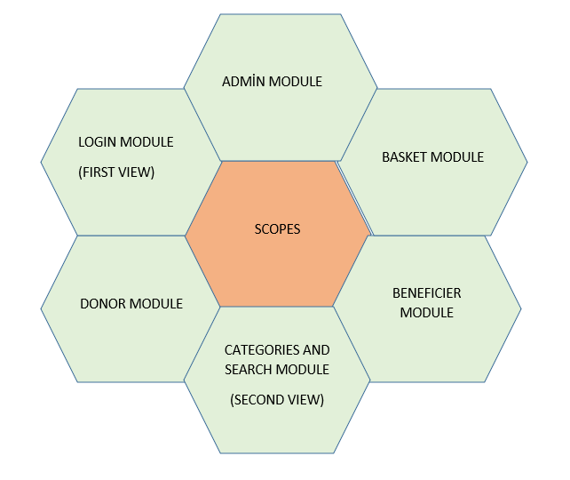
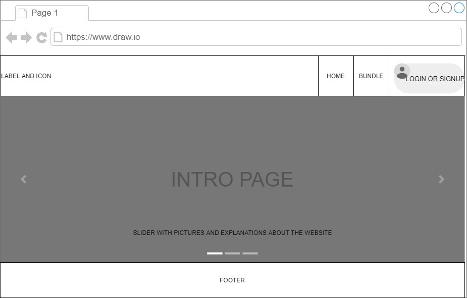
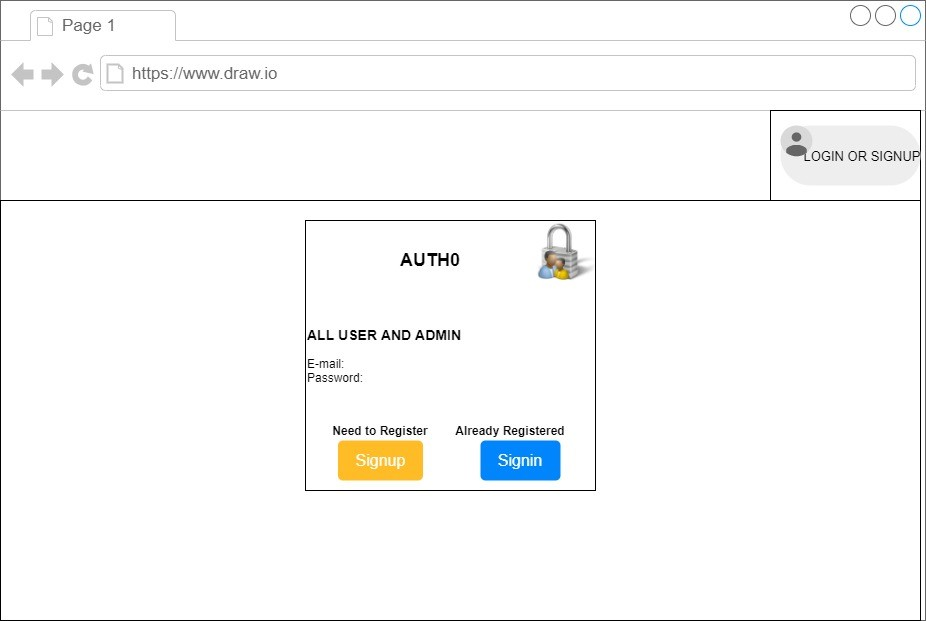
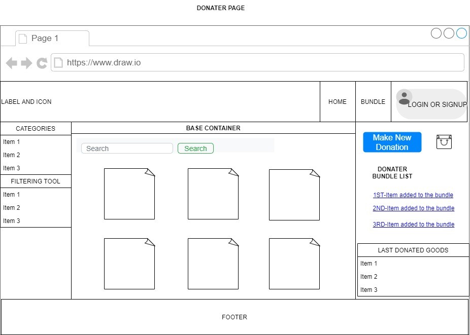
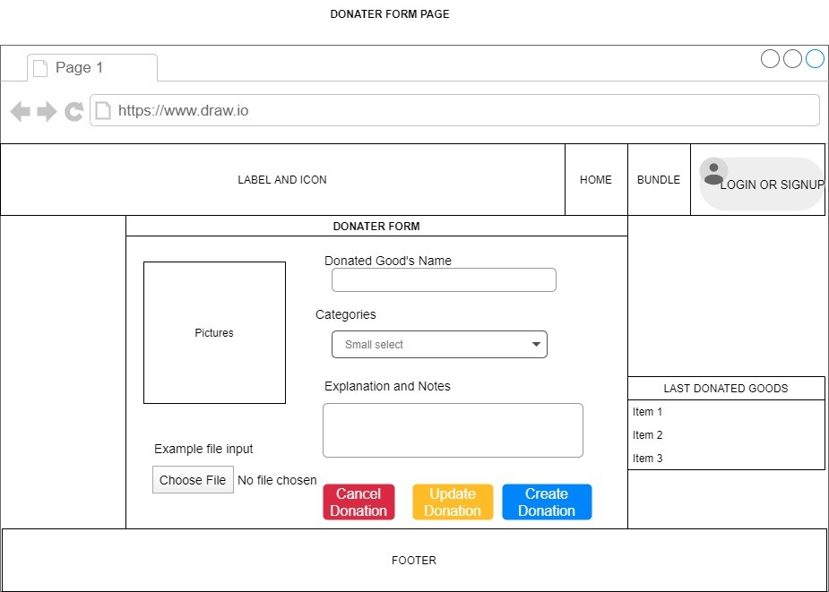
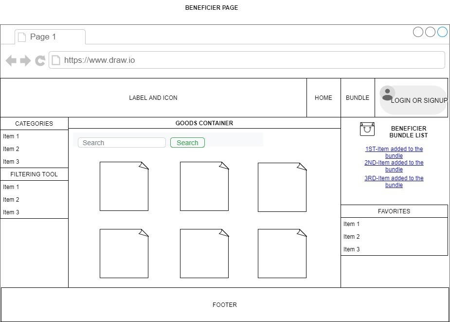
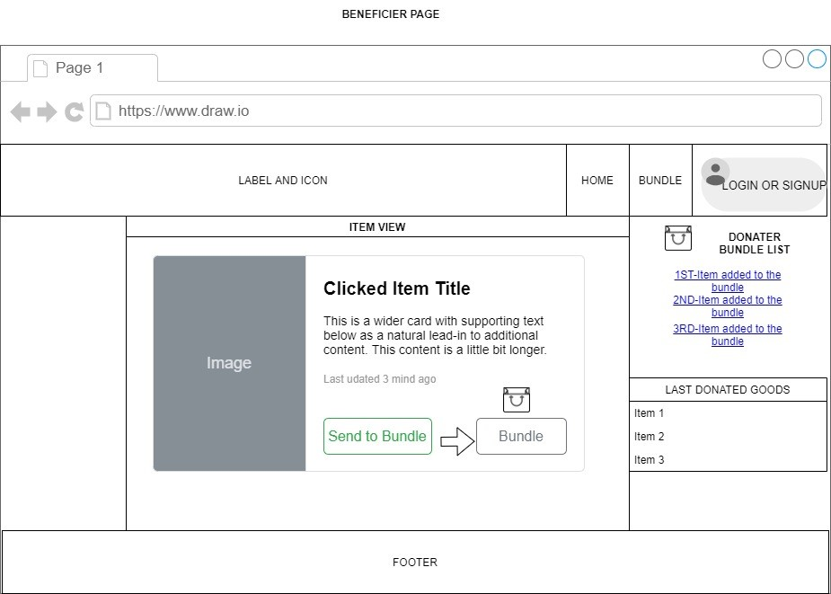
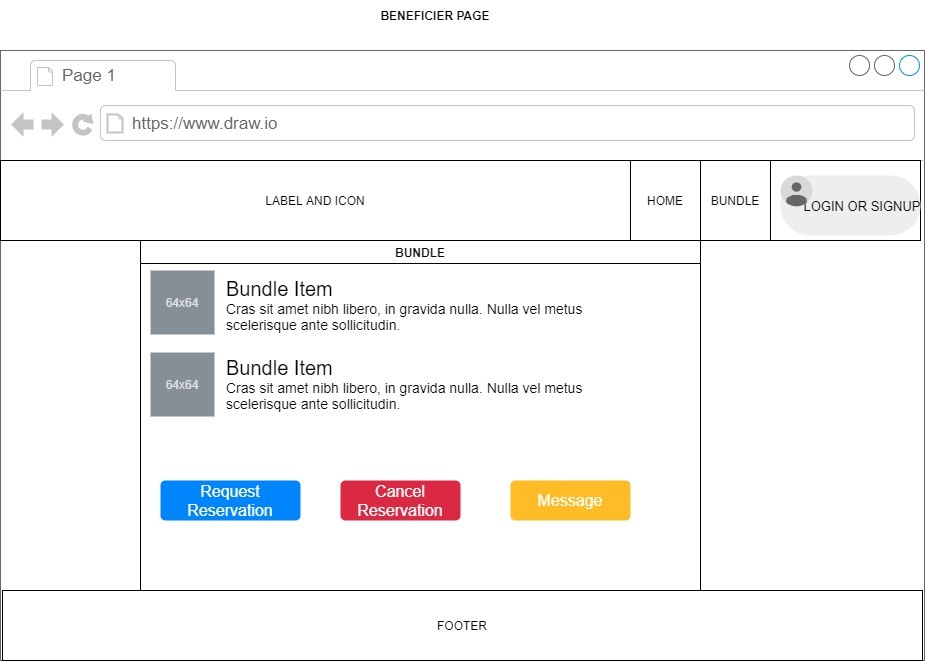

# BundleReact

This repository contains frontend section of the capstone project named "Bundle Project". Frontend infrastructure based upon Javascript and React. This frontend section has different kind of implementations of React (useContext, useForm) and other tools like Auth0, Firebase. It was mostly designed for getting some experience by using different things.

For the backend structure established on REST API which utilizes HTTP methods. Express and swagger libraries also helped to make them processed properly. Postman also used for testing the HTTP methods. 

The models on backend structure designed with Sequelize and it uses MySQL as database configuration. One of the Amazon Web Services, Amazon RDS was also experienced by creating the MySQL database through that service options. 
As a different experience Google's Firebase Storage was also used to store the donation form data. 

### Opening the project `npm start`

Runs the app in the development mode.\
Open [http://localhost:3000](http://localhost:3000) to view it in your browser.

Before it needs backend module activated which is here: https://github.com/Raptorex65/BundleBackend

## Learn More

You can learn more in the [Create React App documentation](https://facebook.github.io/create-react-app/docs/getting-started).

To learn React, check out the [React documentation](https://reactjs.org/).

## ABOUT PROJECT

## Background

There are various web platforms that encourage sharing and cooperation by changing the consumption-based understanding throughout Switzerland, but there is no platform that brings together the needy people and those who want to get rid of the things they don't need in order to do charity for free. Therefore, there is a need for a platform that brings together the benefactor and those in need of help based on social assistance in the web environment and enables the exchange of goods.
The needs of these two groups are met in a limited way through aid organizations. In addition, since the goods sent to these aid organizations are frequently used by those who trade second-hand goods to make a profit, they directly prevent the needs of the desired segment.

## Business Case

Solution will be provided to the following sub-problem areas as a platform that will bring together the benefactor and those who need help, and enable the exchange of unnecessary goods:
• For those who want to share their belongings on the internet in order to help, an environment will be prepared where they can communicate with those who request, by providing photos and information of their belongings.
• An environment will be prepared where those who want to find second-hand goods free of charge by only bearing the burden of transportation and transportation can browse through various main categories and inquire about the materials they need.
• A secure environment based on the member system will be prepared where people who will provide assistance or request items can log in by signing in/signup.
• Certain restrictive documents will be requested from the persons who will inquire about the goods in order to obtain the registration approval.
• The Administrator will have full control authority to follow the items placed, make changes on this information in order to ensure the efficiency of the program, query and edit the information entered in the communication modules.

## Goals

First of all, our main goal is to strengthen the understanding of cooperation and solidarity in the society by building a bridge between those who act to help and those who need help. In an economic system where consumption is strongly imposed, a platform that will reduce consumption and ensure that usable goods are delivered to those in need free of charge or at a very low price will also contribute to the increase of solidarity and neighborhood sensitivity in the society.

## Scope

## Design (Abstract)

